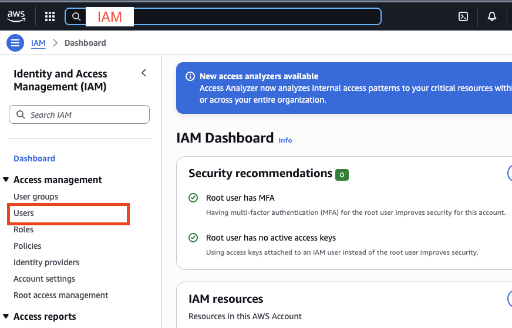
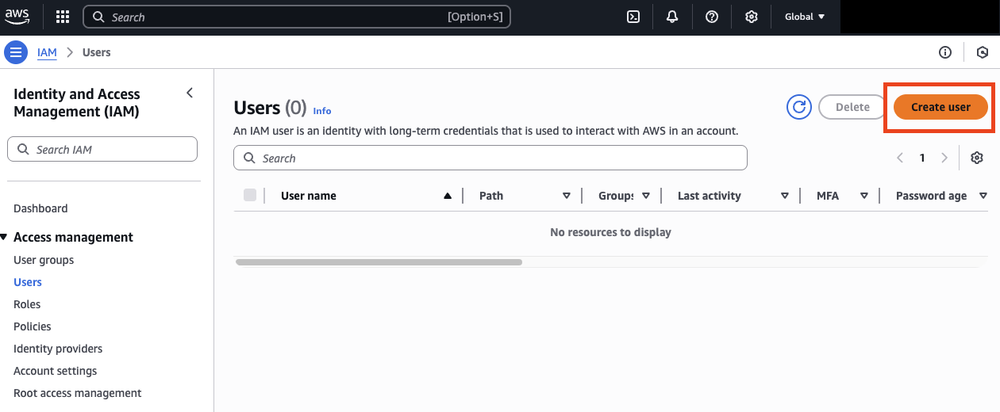
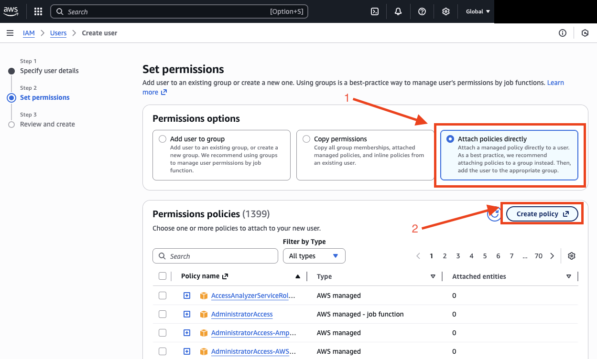
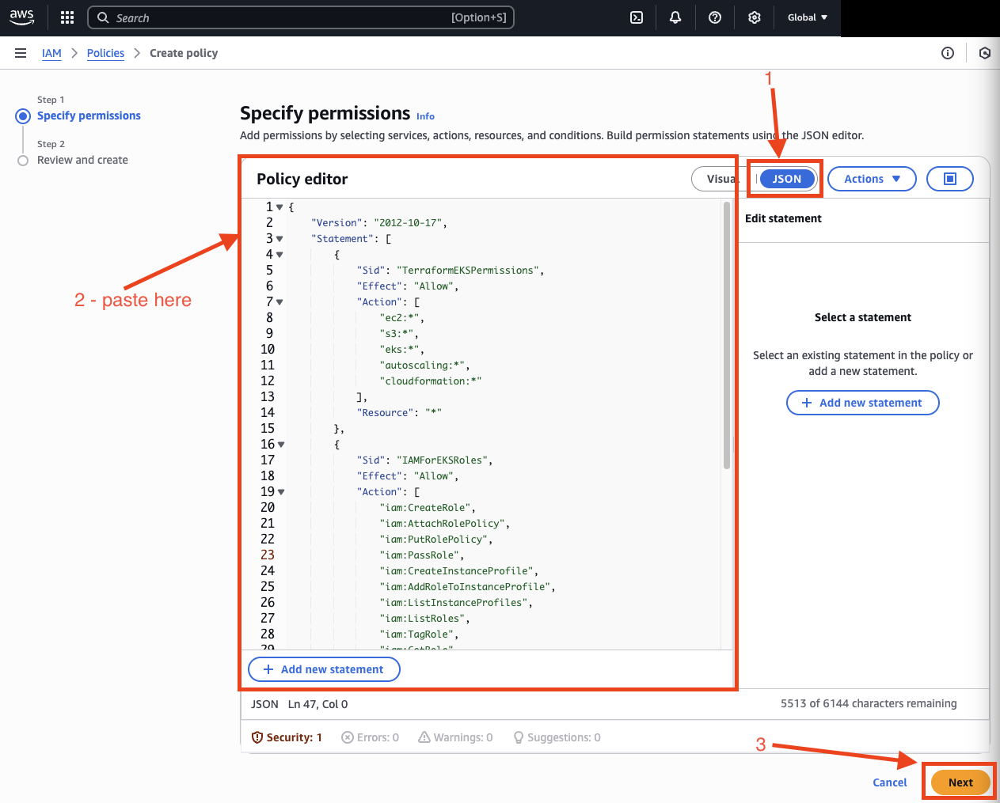
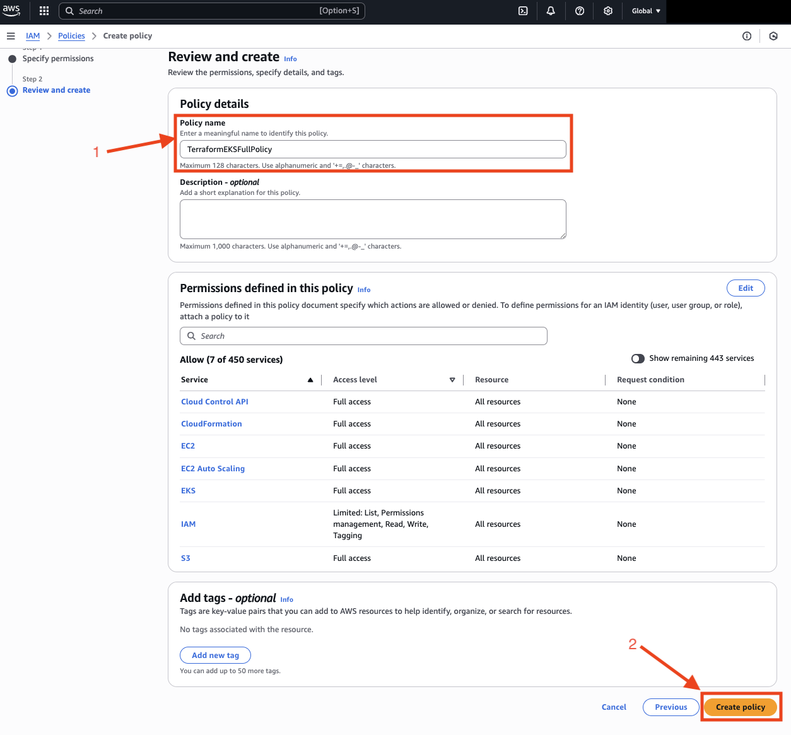
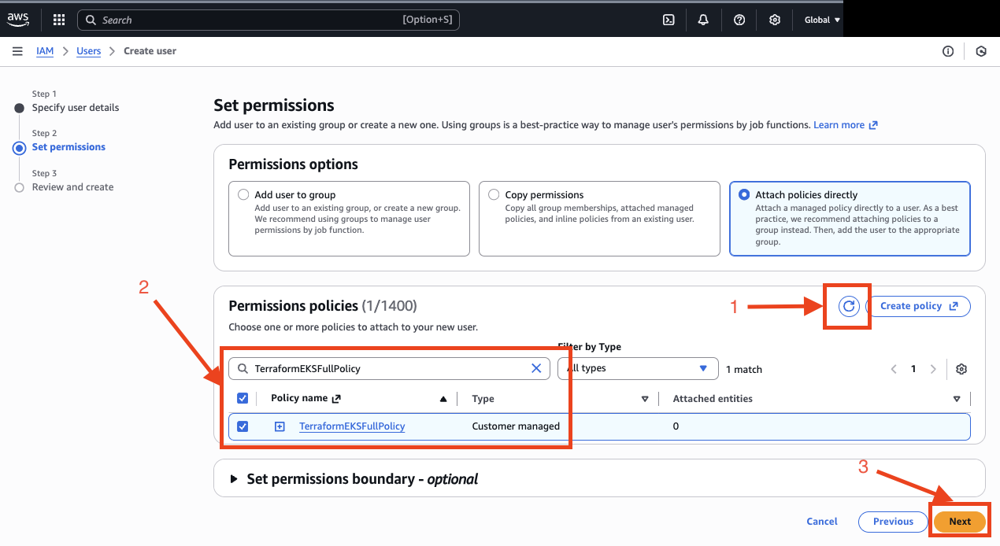
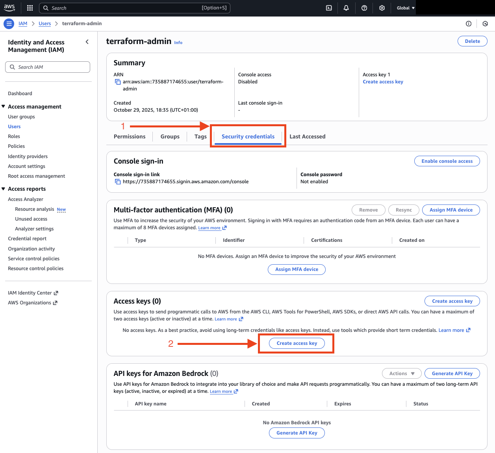
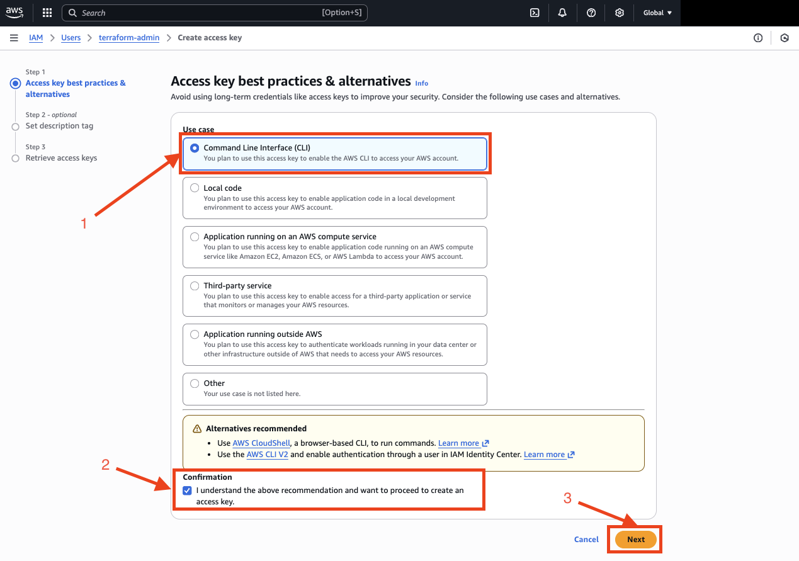

# Deploy Boutique Application on EKS

## 0. Prerequisites

Start with [Prerequisites](./Prerequisites.md)

## 1. Log in to [AWS Management Console](https://aws.amazon.com/console/)

## 2. Setup Terraform IAM User
In AWS, the security model is different. We **NEVER** use the `root` account for work. Instead, we create an IAM administrator account and generate access keys for it.

### 2.1 Create IAM User

In the search bar at the top, type `IAM` and go to the IAM service.



In the menu on the left, click `Users`, then `Create user`. Enter a username, for example `terraform-admin`.
Click `Next`.



On the next page (***"Set permissions"***), select `Attach policies directly`.
Above the list of policies, click the `Create policy` button. This will open a new browser tab.



In the new tab, select the `JSON` editor.
Delete all the existing content and paste the following JSON policy. 
This policy gives Terraform permissions to manage EKS, VPC, EC2, IAM roles, and S3, and is much safer than AdministratorAccess.

Click `Next`.




Give the policy a name, for example, `TerraformEKSFullPolicy`.

Click `Create policy`.



Now, return to the original browser tab where you were creating the user.

Click the Refresh button (the circular arrow icon) above the list of policies.

In the search bar, type the name of your new policy (e.g., `TerraformEKSFullPolicy`).

Check the box next to your new policy.



Click `Next` until the user is created.

### 2.2 Generate access key

Click on the name of the user you just created (for example terraform-admin).

Go to the `Security credentials` tab.

Scroll down to the `Access keys` section and click `Create access key`.



Choose the `Command Line Interface (CLI)` option.

Confirm that you understand the recommendations, click `Next` and then click `Create access key`.

**IMPORTANT:** Two values will be displayed: the Access key ID and the Secret access key. **Save them immediately in a secure place. Once you close this window, you will never be able to see the secret key again.** (if you forgot to save them, just go ahead and generate another access key :-])



## 3. Install [AWS CLI](https://docs.aws.amazon.com/cli/latest/userguide/getting-started-install.html)

## 4. Verify the installation

If successful, you should now be able to use the aws CLI:
```sh
aws --version
```

## 4. Configure your AWS credentials

Run:
```sh
aws configure
```

Enter your:

* AWS Access Key ID
* AWS Secret Access Key
* Default region name (e.g. eu-central-1)
* Default output format (e.g. json)

To verify:
```sh
aws sts get-caller-identity
```

## 5. Configure Ansible and Terraform

Create a vault file for AWS credentials using template:
`ansible/inventories/group_vars/aws/template.vault.yaml`

Add:
```yaml
vault_aws_access_key: "<your-access-key-id>"
vault_aws_secret_key: "<your-secret-access-key>"
```

Then,
Create a vault file for AWS credentials using template:
Rename `ansible/inventories/group_vars/aws/template.vault.yaml` -> `ansible/inventories/group_vars/aws/vault.yaml`

Encrypt it (and save the password, you're going to use quite often...):
```sh
ansible-vault encrypt ansible/inventories/group_vars/aws/vault.yaml
```

## 8. Run Ansible Automation

Navigate to the `ansible/` directory and execute the playbooks below in order.

### 8.1. Create Terraform State S3 Bucket

This creates an S3 bucket for storing Terraform state files.
```sh
ansible-playbook -i inventories/prod.ini playbooks/aws/tfstate_bucket/create.yaml -v --ask-vault-pass
```

### 8.2. Create VPC

Create a dedicated VPC with subnets and security groups for the cluster:
```sh
ansible-playbook -i inventories/prod.ini playbooks/aws/vpc/create.yaml -v --ask-vault-pass
```

### 8.3. Deploy Application

Creates the EKS cluster, worker nodes, and deploys the Boutique app via Helm.
```sh
ansible-playbook -i inventories/prod.ini playbooks/aws/create_boutique.yaml -v --ask-vault-pass
```

At the end, you will receive a public endpoint to access the application, for example:
https://a1b2c3d4e5f6g7h8.elb.us-east-1.amazonaws.com/

Connect to EKS Cluster using local kubectl

Ensure you have `kubectl` and `aws-iam-authenticator` installed.

Retrieve credentials:

```sh
aws eks update-kubeconfig --name boutique-k8s-cluster --region eu-central-1
```

Verify access:

```sh
kubectl get ns
```

If the output lists Kubernetes namespaces, your connection is active.
