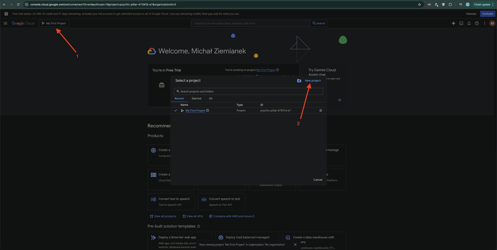
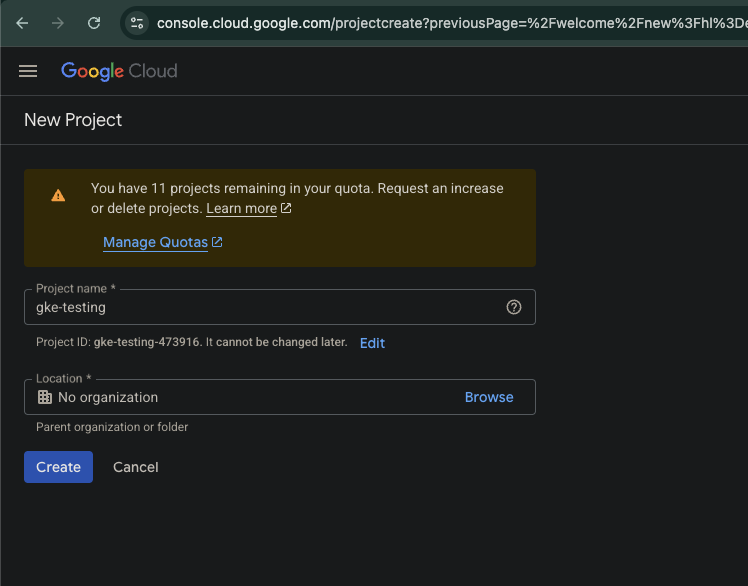
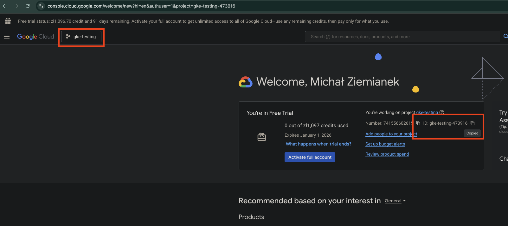
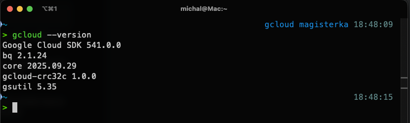

# Deploy Boutique Application on GKE

## 0. Prerequisites
Start with [Prerequisites](./Prerequisites.md).

## 1. Log in to [Google Cloud Platform](https://console.cloud.google.com/)

## 2. Create a new project and set it as the active one  

  


Copy the **Project ID** – it will be required later in Terraform.  



## 3. Install [gcloud CLI](https://cloud.google.com/sdk/docs/install) for your operating system

## 4. Verify the installation  
If successful, you should now be able to use the `gcloud` CLI:  



## 5. Authenticate gcloud CLI with your Google account  
Run:
```sh
gcloud init
```
And follow the interactive configuration process, log in with your Google account, and select the appropriate project.

## 6. Enable Required APIs
Run:
```sh
gcloud services enable \
    compute.googleapis.com \
    container.googleapis.com \
    iam.googleapis.com \
    cloudresourcemanager.googleapis.com
```

* `compute.googleapis.com` (Compute Engine API)
→ Provides VM instances, networks (VPC, subnetworks), firewalls, load balancers, etc.
GKE uses Compute Engine for worker nodes and networking components.

* `container.googleapis.com` (Kubernetes Engine API)
→ Core API for creating and managing Google Kubernetes Engine (GKE) clusters: cluster creation, node pools, autoscaling, updates.

* `iam.googleapis.com` (Identity and Access Management API)
→ Manages service accounts, roles, and permissions.
Required to create a service account for Terraform and assign roles such as roles/container.admin.

* `cloudresourcemanager.googleapis.com` (Cloud Resource Manager API)
→ Manages projects, organizations, and IAM policies at the project level.
For example, needed when Terraform/Ansible assign roles within the project.

## 7. Create and Configure a Service Account
This account will be used by Ansible and Terraform.
```sh
gcloud iam service-accounts create terraform-sa \
    --display-name="Terraform Service Account"
```

Assign roles:
```sh
export PROJECT_ID=<your-copied-project-id>

gcloud projects add-iam-policy-binding $PROJECT_ID \
  --member="serviceAccount:terraform-sa@$PROJECT_ID.iam.gserviceaccount.com" \
  --role="roles/editor"

gcloud projects add-iam-policy-binding $PROJECT_ID \
  --member="serviceAccount:terraform-sa@$PROJECT_ID.iam.gserviceaccount.com" \
  --role="roles/container.admin"
```

## 8. Configure Ansible and Terraform
Generate credentials for Infrastructure as Code (IaC):
```sh
gcloud iam service-accounts keys create ~/terraform-sa-key.json \
  --iam-account=terraform-sa@$PROJECT_ID.iam.gserviceaccount.com
```

Copy the contents of the generated file into:
`ansible/inventories/group_vars/gcp/template.vault.yaml`

Delete the original file:
```sh
rm ~/terraform-sa-key.json
```

Rename `template.vault.yaml` → `vault.yaml` and encrypt it with Ansible Vault:
```sh
ansible-vault encrypt ansible/inventories/group_vars/gcp/vault.yaml
```

## 9. Run Ansible Automation

Navigate to the `ansible/` directory and run the following playbooks in order:

### 9.1. Create Terraform state bucket
This creates a bucket in Google Cloud Storage where Terraform state will be stored.
Password = the same vault password you used when encrypting vault.yaml.
```sh
ansible-playbook -i inventories/prod.ini playbooks/gcp/tfstate_bucket/create.yaml -v --ask-vault-pass
```

### 9.2. Create VPC
```sh
ansible-playbook -i inventories/prod.ini playbooks/gcp/vpc/create.yaml -v --ask-vault-pass
```

### 9.3. Set up application
```sh
ansible-playbook -i inventories/prod.ini playbooks/gcp/create_boutique.yaml -v --ask-vault-pass
```

At the end, you will get a URL that you can use to access the application, for example: `https://34.118.2.252/`

# Connect to GKE Cluster using local kubectl

Install GKE auth plugin:
```sh
gcloud components install gke-gcloud-auth-plugin
```

You need just this one command...
```sh
gcloud container clusters get-credentials boutique-k8s-cluster --region europe-central2
```

Run this command to verify if you have access to your GKE cluster
```sh
kubectl get ns
```

You should see namespaces from your GKE cluster. The environment is now ready.
