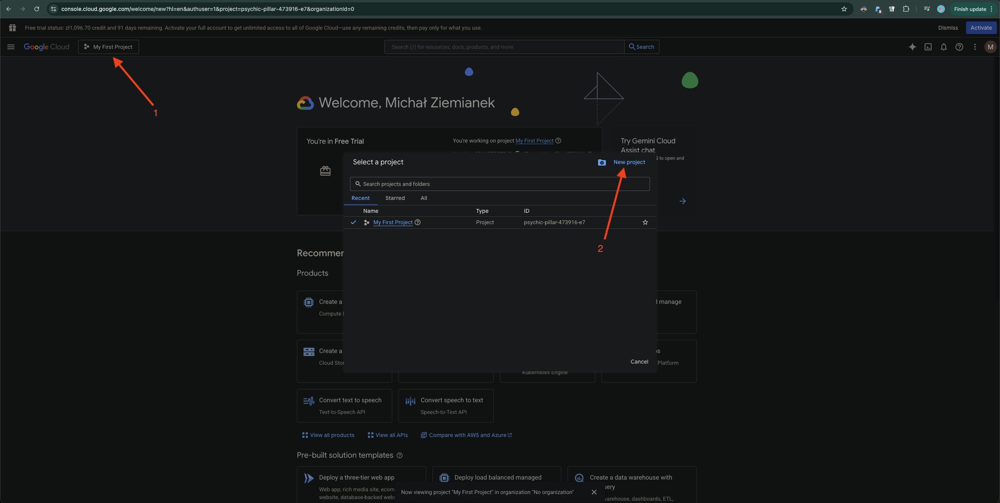
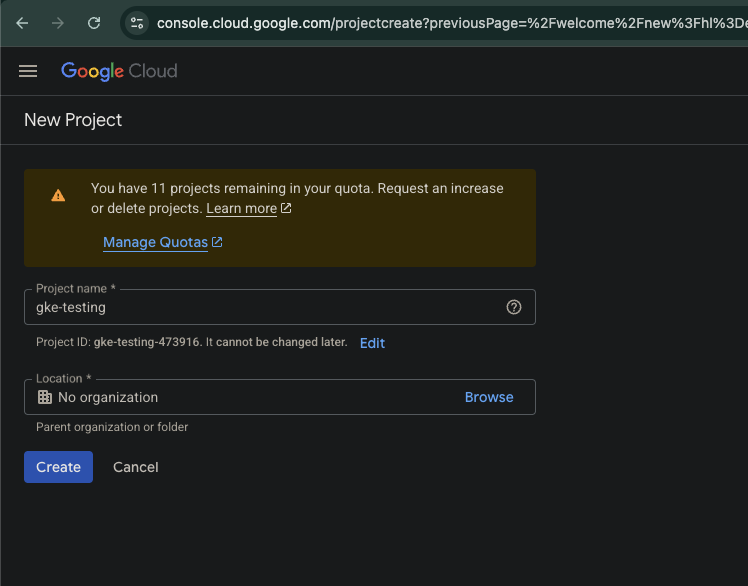
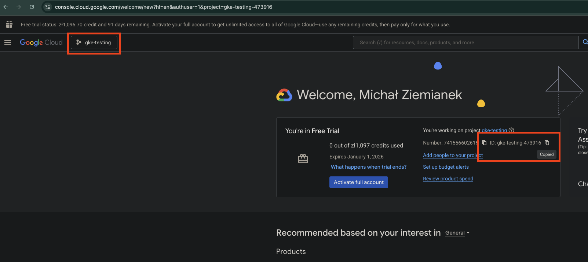
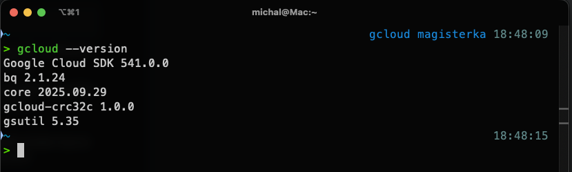

# How to setup GKE Cluster

# Prerequisites
Zacznij od [Prerequisites](./Prerequisites.md)

## 1. Zaloguj sie do [Google Cloud Platform](https://console.cloud.google.com/)

## 2. Utworz nowy projekt i wybierz go jako aktywny. Skopiuj ID projektu - bedzie potrzebne do terraforma




## 3. Zainstaluj [gcloud CLI](https://cloud.google.com/sdk/docs/install) dla twojego systemu operacyjnego

## 4. Jesli instalacja sie powiodla, powinines teraz moc uzywac gcloud CLI


## 5. Polacz gcloud CLI z twoim kontem google
Wywolaj komende
```sh
gcloud init
```
I sledz proces konfiguracji. Zaloguj sie do swojego konta google i wybierz odpowiedni projekt

## 6. Aktywuj wymagane API
```sh
gcloud services enable \
    compute.googleapis.com \
    container.googleapis.com \
    iam.googleapis.com \
    cloudresourcemanager.googleapis.com
```
`compute.googleapis.com (Compute Engine API)`
→ odpowiada za instancje VM, sieci (VPC, subnetwork), firewalle, load balancery itp.
GKE korzysta z Compute Engine do uruchamiania węzłów roboczych i komponentów sieciowych.

`container.googleapis.com (Kubernetes Engine API)`
→ główne API do tworzenia i zarządzania klastrami Google Kubernetes Engine (GKE): tworzenie klastra, node pooli, autoskalowanie, aktualizacje.

`iam.googleapis.com (Identity and Access Management API)`
→ zarządza kontami serwisowymi, rolami i uprawnieniami.
Bez tego nie utworzysz konta serwisowego dla Terraform ani nie nadasz mu ról typu roles/container.admin.

`cloudresourcemanager.googleapis.com (Cloud Resource Manager API)`
→ zarządza projektami, organizacjami i politykami IAM na poziomie projektu.
Np. kiedy Terraform/Ansible mają przypisywać role do konta w danym projekcie.

## 7. Utworz i skonfiguruj Service Account
To konto bedzie uzywane przez Ansible i Terraform
```sh
gcloud iam service-accounts create terraform-sa \
    --display-name="Terraform Service Account"

```
Nastepnie nadaj mu uprawnienia
```sh
export PROJECT_ID=<your-copied-project-id>
```

```sh
gcloud projects add-iam-policy-binding $PROJECT_ID \
  --member="serviceAccount:terraform-sa@$PROJECT_ID.iam.gserviceaccount.com" \
  --role="roles/editor"
```

```sh
gcloud projects add-iam-policy-binding $PROJECT_ID \
  --member="serviceAccount:terraform-sa@$PROJECT_ID.iam.gserviceaccount.com" \
  --role="roles/container.admin"
```

## 8. Skonfiguruj Ansible i Terraform

Wygeneruj credentials dla IaC
```sh
gcloud iam service-accounts keys create ~/terraform-sa-key.json \
  --iam-account=terraform-sa@$PROJECT_ID.iam.gserviceaccount.com 
```

Skopiuj zawartosc pliku i wklej ja do `ansible/inventories/group_vars/gcp/template.vault.yaml`. Nastepnie usun plik `~/terraform-sa-key.json`

Nastepnie zmien nazwe pliku z `template.vault.yaml` na `vault.yaml` i zaszyfruj uzywajac `ansible-vault`

```sh
ansible-vault encrypt ansible/inventories/group_vars/gcp/vault.yaml
```

## 9. Ansible
### 9.1. tfstate bucket
```sh
```
### 9.2. vpc
```sh
```
### 9.3. gke cluster
```sh
```